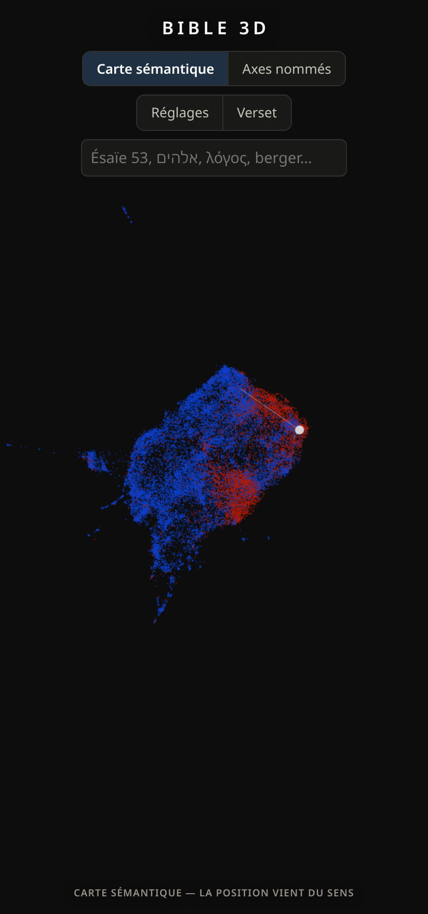

# Bible 3D — visualisation sémantique

[English](README.md) · **Français**

### → [Ouvrir la carte en ligne](https://macmachi.github.io/bible-3D/)

*31 170 versets dans le navigateur, rien à installer. Fonctionne hors ligne une
fois chargée.*

Les **31 170 versets** de la Bible placés dans un espace tridimensionnel **selon
ce qu'ils veulent dire**, et non selon leur position dans le livre. Deux versets
voisins à l'écran parlent de la même chose, même s'ils sont séparés par mille
pages et deux langues.

Quatre textes en regard : **hébreu massorétique** (Westminster Leningrad Codex),
**grec** (SBLGNT), **français** (Louis Segond 1910) et **anglais** (World English
Bible). Interface en français et en anglais.

> **La géométrie est calculée sur une traduction, et l'on choisit laquelle.**
> Deux cartes sont livrées : l'une calculée sur **Louis Segond 1910**, l'autre
> sur la **World English Bible**. Ce ne sont pas deux versions d'une même carte.
> Deux versets côte à côte chez Segond peuvent se retrouver loin l'un de l'autre
> dans la WEB, leurs plus proches parents diffèrent, et les amas ne sont pas les
> mêmes groupes. Cet écart est le sujet, pas un défaut. Un sélecteur dans
> l'en-tête passe de l'une à l'autre, et la légende posée sur la carte nomme en
> permanence le texte en vigueur.
>
> L'hébreu et le grec sont alignés verset par verset, conservés et affichés
> avec chaque point, mais ce n'est *pas* eux qui le placent. Aucun modèle
> d'embedding de phrases n'est entraîné sur l'hébreu biblique ou le grec
> koinè ; en appliquer un au texte massorétique produirait un nuage
> d'apparence convaincante dont les regroupements ne voudraient rien dire.
>
> C'est la chose la plus importante à savoir avant de lire la carte : ce que
> l'on voit est le sens **tel que rendu par un traducteur**, et non une vérité
> indépendante de lui. Le raisonnement, et la façon de le vérifier soi-même,
> sont dans
> [Le sens est calculé sur une traduction, pas sur l'hébreu](#1-le-sens-est-calculé-sur-une-traduction-pas-sur-lhébreu).

Aucune connaissance n'est donnée à la machine : elle ignore les livres, les
auteurs, les genres et la chronologie. Elle ne voit que du texte. Tout
regroupement visible a donc été **trouvé**, pas imposé.


*Le bleu est l'Ancien Testament, le rouge le Nouveau. Là où les deux se mêlent,
les deux Testaments traitent du même sujet. Le verset consulté, Matthieu 6:12,
a été trouvé en décrivant une idée — « le pardon des offenses » — et non en
cherchant un mot.*

---

## Table des matières

- [Démarrage](#démarrage)
- [Ce que l'on voit](#ce-que-lon-voit)
- [Méthode : du texte aux coordonnées](#méthode--du-texte-aux-coordonnées)
- [Quatre décisions de méthode](#quatre-décisions-de-méthode)
- [Sortir du « proche de quoi ? »](#sortir-du--proche-de-quoi--)
- [Confronter la carte à la tradition](#confronter-la-carte-à-la-tradition)
- [Sur la recherche d'un code caché](#sur-la-recherche-dun-code-caché)
- [Organisation du code](#organisation-du-code)
- [Schéma des données](#schéma-des-données)
- [Ce qui est vérifié](#ce-qui-est-vérifié)
- [Limites connues](#limites-connues)
- [Dépannage](#dépannage)
- [Licences et copyright](#licences-et-copyright)

---

## Démarrage

Prérequis : Python 3.11 ou plus (testé en 3.14), ~5 Go de disque, aucune carte
graphique nécessaire.

```bash
python3 -m venv .venv
./.venv/bin/pip install torch --index-url https://download.pytorch.org/whl/cpu
./.venv/bin/pip install -r requirements.txt

export PYTHONPATH=src
./.venv/bin/python -m bible_visu.fetch      # ~55 Mo de textes sources
./.venv/bin/python -m bible_visu.corpus     # table de versets alignés
./.venv/bin/python -m bible_visu.embed      # le plus long — voir le tableau
./.venv/bin/python -m bible_visu.project    # UMAP 3D + amas + voisinage
./.venv/bin/python -m bible_visu.crossrefs  # renvois traditionnels
./.venv/bin/python -m bible_visu.axes       # axes thématiques nommés (~2 min)
./.venv/bin/python -m bible_visu.export     # données du visualiseur
./.venv/bin/python serve.py                 # ouvre http://127.0.0.1:8000
```

Cela construit la carte du Segond. L'anglaise, ce sont les trois mêmes étapes
avec `--basis en`, puis un seul export qui écrit les deux :

```bash
./.venv/bin/python -m bible_visu.embed   --basis en   # ~75 min, aussi long que le premier
./.venv/bin/python -m bible_visu.project --basis en
./.venv/bin/python -m bible_visu.axes    --basis en
./.venv/bin/python -m bible_visu.export                # reprend toutes les bases présentes
```

`--basis` décide à la fois de la colonne encodée et du nom des fichiers écrits,
si bien que les deux cartes ne s'écrasent jamais. Les fichiers français gardent
les noms qu'ils ont toujours eus ; les anglais s'installent à côté avec un
suffixe `_en`. Sauter cette partie ne casse rien : le visualiseur n'offre alors
qu'une carte et cache le sélecteur. `crossrefs` accepte aussi `--basis`, mais
seulement pour rejouer la confrontation avec la tradition sur l'autre carte —
les renvois eux-mêmes sont indexés par référence et n'appartiennent à aucune
des deux.

Tout reste dans le dossier du projet, **cache des modèles compris**
(`data/models/`, ~3 Go). Rien n'est écrit dans `~/.cache`, rien n'est installé
sur le système.

Chaque étape lit et écrit sur disque : on peut relancer la projection avec
d'autres réglages sans refaire l'encodage, qui est de loin le plus coûteux.
Les options de `bible_visu.project` qui changent le plus la carte :
`--n-neighbors` (petit : filaments, grand : grandes masses), `--min-dist`
(compacité des amas), `--min-cluster-size` (taille minimale d'un amas HDBSCAN),
`--abtt-neighbours` (débruitage du voisinage, 8 par défaut), `--seed`
(projection reproductible à graine égale). Les axes thématiques se modifient
dans la table `AXES` de `src/bible_visu/axes.py` — écrire quelques phrases par
pôle, relancer `bible_visu.axes` puis `bible_visu.export` — et les traductions
dans `corpus.py --translation darby --secondary kjv` (voir `TRANSLATIONS` dans
`sources.py`).

### Coût de l'encodage

Mesuré sur un portable récent, 22 cœurs, sans GPU :

| Modèle | Dimension | Débit | Corpus complet |
|---|---|---|---|
| `intfloat/multilingual-e5-base` | 768 | 22,2 versets/s | ~23 min *(extrapolé)* |
| `intfloat/multilingual-e5-large` *(défaut)* | 1024 | 7,1 versets/s | **72,7 min** *(mesuré)* |

Pour une première exploration, `--model intfloat/multilingual-e5-base` donne une
carte déjà très lisible en un tiers du temps. Les étapes suivantes sont rapides :
projection ~5 min, renvois ~2 min, axes ~2 min, export quelques secondes.

**La seconde carte coûte autant que la première.** La passe anglaise sur le même
corpus, même modèle, même machine : 8,2 versets/s, **63,2 min mesurées**. Il n'y
a pas de raccourci — une carte, c'est l'encodage de chaque verset, et les
versets anglais ne sont pas les versets français.

### Ce que produit une exécution complète

Le corpus, commun aux deux cartes :

| | |
|---|---|
| Versets | 31 170 |
| Alignement avec le texte original | 31 031 (99,55 %) |
| Alignement avec l'anglais | 31 050 (99,62 %) |
| Renvois traditionnels chargés | 548 109 liens |

Et ce que chaque carte en fait :

| | Segond 1910 | World English Bible |
|---|---|---|
| Amas trouvés | 71 | 61 |
| Versets hors amas | 14 503 (46,5 %) | 13 170 (42,3 %) |
| Similarité médiane au plus proche voisin | 0,934 | 0,919 |
| Versets ayant un parent dans l'autre Testament | 14 225 (45,6 %) | 14 662 (47,0 %) |
| Accord avec la tradition | 81,8 % | 81,1 % |
| Données du visualiseur | `verses.json` 20,1 Mo (5,7 Mo compressé) · `positions.bin` 365 Ko · `axes.bin` 974 Ko | `geometry_en.json` 3,0 Mo (0,9 Mo compressé) · `positions_en.bin` 365 Ko · `axes_en.bin` 974 Ko |

Deux chiffres méritent qu'on s'y arrête. **L'accord avec la tradition bouge à
peine** : 81,8 % contre 81,1 %, à partir de deux traductions qui placent les
versets assez différemment pour produire dix amas de moins. Ce que capte le
voisinage sémantique n'est donc pas un artefact du français de Segond. Et **la
carte anglaise range un peu plus de versets**, 42,3 % hors amas contre 46,5 %,
ce qui dit quelque chose de l'uniformité de registre des deux traductions et
rien de la qualité de l'une ou de l'autre.

Le fort taux de « hors amas » n'est pas un défaut : HDBSCAN refuse d'affecter les
points situés en zone peu dense, plutôt que de les ranger de force quelque part.
Baisser `--min-cluster-size` en réduit la proportion.

---

## Ce que l'on voit

L'écran tient en quatre zones :

* **au centre en haut** — le nom, puis les trois seules décisions
  structurantes : la **disposition** (carte sémantique ou axes nommés), le
  **texte sur lequel la carte est calculée** (Segond 1910 ou World English
  Bible) et la **recherche**. Le deuxième n'apparaît que si les deux cartes ont
  été construites ; avec une seule, il n'y a rien à choisir ;
* **au centre en bas** — une légende posée **sur la carte**, qui rappelle en
  permanence ce que la vue en cours signifie. C'est la première chose à lire ;
* **à gauche** — la langue, l'encart « comment lire », puis les réglages :
  couleur, filtres, amas, affichage. Les trois sélecteurs d'axes n'y
  apparaissent qu'en disposition « axes nommés », puisqu'ailleurs ils ne
  servent à rien ;
* **à droite** — le verset consulté.

Les deux textes explicatifs — la légende du bas et l'encart « comment lire » —
**changent avec la disposition**, parce que ce qui est vrai de l'une est faux de
l'autre : sur la carte sémantique les directions ne signifient rien, sur les
axes nommés elles signifient tout.

**Changer de carte.** Choisir l'autre texte recharge la géométrie et fait
glisser chaque point vers sa nouvelle place : regarder le nuage se réagencer est
la mesure la plus claire du désaccord entre les deux traductions. Trois choses
sont remises à zéro au passage, parce qu'elles ne veulent rien dire d'une carte
à l'autre — un amas sélectionné (les numéros se correspondent, pas les groupes),
une recherche par thème (ses similarités ont été mesurées dans l'autre espace
vectoriel) et la disposition par axes si cette carte n'en a pas. Tant que l'on
n'a pas choisi soi-même, la carte suit la langue de l'interface : lire en
anglais en regardant la géométrie du Segond mettrait un décalage permanent entre
le texte affiché et ce qui le place. Une fois le choix fait, il tient, et changer
de langue ne le déplace plus.

Sur écran étroit (moins de 1100 px), les deux panneaux deviennent des tiroirs
fermés que l'on ouvre par les boutons **Réglages** et **Verset** : la carte
occupe alors tout l'écran, ce qui est son seul intérêt. Toucher un point ouvre
le tiroir du verset ; `Échap` referme. Le champ de recherche se replie lui aussi,
derrière une loupe posée à droite de ces deux boutons — deux lignes d'en-tête
permanentes pour un geste occasionnel, c'est autant de carte en moins. Le
refermer efface la requête, délibérément : une requête masque les versets qui ne
lui correspondent pas, et un filtre agissant derrière un champ invisible
cacherait la moitié de la Bible sans que rien à l'écran ne le dise.




| Mode de couleur | Ce qu'il révèle |
|---|---|
| **Position dans le canon** *(défaut)* | où le texte se situe dans la Bible. Là où des couleurs éloignées se mélangent, deux passages très distants se ressemblent. |
| **Testament** | les zones où l'Ancien et le Nouveau se recouvrent. |
| **Genre littéraire** | la séparation entre loi, récit, poésie, prophétie, épître. |
| **Amas sémantique** | les groupes trouvés par la machine, sans qu'on lui dise que les livres existent. Seul mode sans liste de couleurs : 71 amas pour dix teintes, une pastille par amas mentirait. Choisir un amas affiche la sienne. |
| **Échos entre testaments** | les versets dont les plus proches parents sémantiques se trouvent dans l'autre Testament — les ponts. |
| **Proximité au thème** | apparaît après une recherche par thème : à quel point chaque verset se rapproche de l'idée décrite. |

Cliquer un point affiche le verset, **chaque texte crédité de son édition** —
on sait donc toujours si l'on lit Segond ou Darby —, puis deux listes distinctes.

Un seul texte reste en clair : celui de la langue de l'interface. Tout le reste
— l'hébreu ou le grec, l'autre traduction — se replie dans un dépliant *Autres
langues*, ouvert par défaut. Rien n'est supprimé : le titre du dépliant dit ce
qui est là, un clic le rouvre, et le choix est mémorisé, si bien que c'est un
réglage et non une manipulation à refaire à chaque verset. Ce qui est en jeu,
c'est la longueur. Trois textes empilés repoussaient les voisins et les renvois
hors de l'écran, c'est-à-dire exactement ce que l'on vient chercher dans ce
panneau. Le texte sur lequel la carte a été calculée n'est pas redoublé ici : le
sélecteur de l'en-tête le nomme en permanence, et la légende du bas le répète.

Les deux listes :

* **ses huit plus proches parents sémantiques** dans toute la Bible, avec la
  similarité chiffrée. ↔ marque un lien qui traverse les deux Testaments, ✓ un
  lien que la tradition relie aussi ;
* **ses renvois traditionnels**, indépendants de tout calcul.

**Partage.** Sélectionner un verset l'inscrit dans la barre d'adresse sous la
forme `#v=Matt.6.12`, et un bouton *Copier le lien* se place à côté de la
référence. Le lien porte ce que l'on regarde — le verset, la disposition, les
trois axes, le mode de couleur et **quelle carte** — et volontairement **pas**
les filtres : un lien qui masquerait la moitié de la Bible sans le dire
laisserait croire au lecteur qu'il voit tout. La carte voyage parce que les plus
proches parents d'un verset ne sont pas les mêmes d'un texte à l'autre :
partager « regarde de quoi ce verset est le plus proche » sans dire dans quelle
carte, ce serait partager une affirmation dont l'autre ne verrait pas la preuve.
Il ne porte pas la langue, la référence OSIS étant neutre, ni l'angle de caméra,
qui sur la carte sémantique ne signifie rien. Ouvrir le lien de quelqu'un ne
remplace jamais vos propres réglages — la carte qu'il transporte vaut pour la
visite et n'est pas enregistrée comme votre choix.

**Navigation :** clic gauche glissé pour tourner, molette pour zoomer, clic droit
glissé pour déplacer. La recherche accepte une référence (`Ésaïe 53` comme
`Isaiah 53`), un mot français ou anglais, et le texte original — coller `אלהים`
ou `λόγος` isole tous les versets qui le contiennent. Accents, voyelles
hébraïques et esprits grecs sont ignorés : `esaie 53` et `logos` fonctionnent.

Ce champ compare du **texte**, jamais du sens : y taper une idée ne trouve que
les versets qui contiennent ces mots-là. Chercher par le sens, c'est l'encart
thématique du panneau de gauche, et il demande `serve.py`. Quand il est
indisponible, une ligne sous le champ de recherche le dit, plutôt que de laisser
conclure que la carte ne sait pas trouver ce qu'on a décrit.

Tous les réglages — filtres, mode de couleur, disposition, taille des points,
rotation, langue — sont conservés d'une session à l'autre ; seule la recherche
en cours ne l'est pas, c'est un état de passage. La langue suit d'abord le choix de l'utilisateur, puis celle du
navigateur, et retombe sur l'anglais si aucune traduction ne correspond.

---

## Méthode : du texte aux coordonnées

Cette section explique la chaîne complète, en partant de zéro.

### 1. Aligner quatre textes sur une même grille

`corpus.py` produit une table d'une ligne par verset, portant côte à côte
l'hébreu, le grec, le français et l'anglais. C'est moins évident qu'il n'y
paraît : la versification massorétique n'est pas celle de Segond, et le texte
critique grec omet des passages que les traductions conservent. L'alignement est
donc **déclaré** verset par verset, jamais bricolé — 139 versets n'ont pas de
texte original et l'interface le dit.

### 2. Transformer chaque verset en un point de 1024 dimensions

C'est le cœur de la méthode. Un **modèle d'embedding de phrases** est un réseau
entraîné pour que deux phrases de sens proche produisent deux vecteurs proches,
et deux phrases sans rapport des vecteurs éloignés. Il ne compare pas des mots :
« pardonne-nous nos offenses » et « ne te souviens plus de mes fautes » n'ont
aucun mot commun et sortent pourtant presque au même endroit.

Le modèle retenu est **`intfloat/multilingual-e5-large`** :

* il produit un vecteur de **1024 nombres** par verset — le corpus entier tient
  dans une matrice de 31 170 × 1024 flottants, soit 128 Mo ;
* il est **multilingue**, ce qui compte moins pour l'encodage (fait sur le
  français, voir plus bas) que pour la recherche par thème, où une requête peut
  être formulée dans une autre langue que le corpus ;
* il exige le préfixe **`query: `** devant chaque texte, sans quoi les vecteurs
  produits ne sont pas dans le même repère que ceux de son entraînement. C'est
  une exigence du modèle, pas une convenance : `embed.py`, `axes.py` et
  `serve.py` l'appliquent tous les trois, sans quoi les similarités calculées à
  un endroit ne seraient pas comparables à celles calculées ailleurs.

Les vecteurs sont **normalisés** (ramenés à une longueur de 1). Le produit
scalaire de deux vecteurs normalisés est alors exactement leur **similarité
cosinus** : 1 pour deux textes identiques de sens, 0 pour deux textes sans
rapport. Toute la suite — voisinage, axes, recherche par thème — n'est qu'une
suite de produits scalaires sur cette matrice.

### 3. Chercher les voisins avant de réduire

Les huit plus proches voisins de chaque verset sont calculés **dans les 1024
dimensions**, jamais sur les coordonnées d'écran. C'est important : la réduction
à trois dimensions déforme, et deux points éloignés à l'écran peuvent être de
très proches parents. Les traits tracés depuis le verset sélectionné le montrent.

La matrice de similarité complète pèserait 31 170 × 31 170 flottants, soit près
de 4 Go ; `project.py` la calcule donc **par tranches**, en ne gardant de chaque
tranche que les huit meilleurs scores.

### 4. Aplatir en trois dimensions avec UMAP

**UMAP** cherche un placement en 3D qui préserve le voisinage : les points
proches dans l'espace d'origine restent proches, au prix des grandes distances.
Il travaille ici en **métrique cosinus**, cohérente avec la normalisation, après
une réduction préalable à 64 composantes principales qui accélère le calcul et
retire un peu de bruit.

Ce que fait UMAP, il faut le dire clairement : il **déforme**. Le voisinage
immédiat est fiable ; l'échelle globale ne l'est pas. C'est pourquoi les axes de
la carte n'ont volontairement aucune signification, et pourquoi la légende de
l'écran le répète.

### 5. Détecter les amas et les nommer

**HDBSCAN** regroupe les points selon la densité, et — c'est sa qualité
principale — **refuse de classer** ceux qui se trouvent en zone peu dense
plutôt que de les rattacher arbitrairement. D'où les 46,5 % de versets « hors
amas », qui sont une réponse honnête et non un échec.

Chaque amas est ensuite nommé par **TF-IDF** : les mots fréquents dans l'amas
*et* rares dans le reste du corpus. C'est une étiquette descriptive, pas un
titre : « travailla · enfanta · meschullam » désigne bien une famille de
généalogies.

### 6. Projeter sur des axes que l'on a nommés d'avance

Voir [Sortir du « proche de quoi ? »](#sortir-du--proche-de-quoi--) — c'est là
que la carte cesse d'être seulement un voisinage et devient lisible.

---

## Quatre décisions de méthode

### 1. Le sens est calculé sur une traduction, pas sur l'hébreu

C'est le point le plus important, et le plus contre-intuitif.

Aucun modèle d'embedding de phrases n'est entraîné sur l'hébreu biblique ou le
grec koinè. Les modèles multilingues disponibles connaissent l'hébreu et le grec
**modernes** — langues dont la morphologie, le lexique et la syntaxe diffèrent
profondément de leurs états anciens. Les appliquer directement au WLC produirait
un nuage d'apparence convaincante mais dont les regroupements ne voudraient rien
dire : le pire résultat possible, parce qu'il est indétectable à l'œil.

Les versets étant alignés 1:1 entre versions, le sens est donc calculé sur la
traduction, tandis que le texte original reste attaché à chaque point. Pour
vérifier ce choix plutôt que le croire :

```bash
./.venv/bin/python -m bible_visu.embed --text-column text_orig \
    --out data/processed/embeddings_orig.npy
```

**C'est pour cela qu'il y a deux cartes et non une.** Une carte unique invite le
lecteur à la prendre pour la forme du texte lui-même. Deux cartes, construites
par la même chaîne à partir de deux traductions, rendent la dépendance visible
au lieu de se contenter de l'énoncer : on bascule de l'une à l'autre et l'on
regarde le nuage se réagencer. Le désaccord que l'on voit est la barre d'erreur
que ce projet devrait sinon demander d'imaginer. Aucune des deux n'est la
référence — la française est simplement arrivée la première, et c'est à ce titre
seulement qu'elle garde les noms de fichiers sans suffixe.

Deux, c'est ce que le code autorise : `paths.BASES` les énumère et le
visualiseur n'accepte que ces deux noms. Une troisième demanderait d'élargir
cette liste, pas seulement de relancer la chaîne.

### 2. Deux espaces vectoriels, parce que la mesure l'a imposé

Le débruitage *All-but-the-Top* (Mu & Viswanath, 2018) retire les quelques
directions communes à tout le corpus, qui encodent la langue et le style plutôt
que le contenu. `scripts/evaluate_abtt.py` le mesure sur un étalon de quinze
citations de l'Ancien Testament par le Nouveau, dont la correspondance ne fait
pas débat.

**Sur la recherche de voisins, le gain est net :**

| | sans débruitage | ABTT = 8 |
|---|---|---|
| Rang médian du vrai partenaire | 1 | 2 |
| Rang moyen | 41 | 3 |
| Dans les 10 premiers | 13/15 | 14/15 |
| Dans les 100 premiers | 13/15 | **15/15** |

Lévitique 19:18 ↔ Matthieu 22:39 (« ton prochain comme toi-même ») passe du
**rang 379 au rang 3** ; Osée 11:1 ↔ Matthieu 2:15 du **rang 207 au rang 12**.

**Sur la disposition, c'est un désastre :** appliqué avant UMAP, le même
traitement aplatit les différences de densité dont HDBSCAN se nourrit. Les
71 amas s'effondrent en **4**, dont un seul absorbe 94 % des versets.

D'où deux espaces : le brut pour dessiner la carte, le débruité pour dire qui
ressemble à qui. C'est réglable — `--abtt-neighbours` et `--abtt-layout`.

Une hypothèse de départ a d'ailleurs été **infirmée** : on attendait du
débruitage qu'il réduise la « gravité narrative », c'est-à-dire la tendance d'un
verset à n'avoir pour voisins que des versets de son propre livre. Mesure : cette
part passe de 36,4 % à 37,8 %. Elle ne baisse pas.

### 3. L'alignement est déclaré, jamais masqué

La versification massorétique diffère de celle de Segond (titres des Psaumes
comptés comme verset 1, découpage de Joël et de Malachie), et le SBLGNT omet les
passages absents des manuscrits les plus anciens (Marc 16:9-20, Jean 5:4, la
péricope de la femme adultère). 139 versets gardent donc leur traduction mais
n'ont pas de texte original ; `corpus.py` en imprime le détail par livre, et
l'interface le dit explicitement au lieu de faire semblant.

La même honnêteté est due aux trous dans l'*autre* sens. 120 versets n'ont pas
de texte anglais. Les encoder comme chaînes vides serait la pire option
disponible : la chaîne vide produit un vecteur, toujours le même, si bien que
ces 120 versets sortiraient identiques entre eux, voisins parfaits les uns des
autres, et se rassembleraient en un amas dense qui ne dit rigoureusement rien.
`embed.py` **retombe donc sur `text_fr` pour tout verset dont la colonne de base
est vide**, ce qui les place au moins selon leur sens, et affiche le compte pour
que la carte ne prétende jamais être plus pure qu'elle n'est. La même règle
couvre les 139 textes originaux manquants sous `--text-column text_orig`.

### 4. La couleur est vérifiée, pas choisie à l'œil

Un nuage de points met potentiellement chaque catégorie au contact de toutes les
autres. Dans ces conditions, mesures à l'appui, la palette de référence ne
garantit la lisibilité — y compris pour les daltonismes protan, deutan et
tritan — que jusqu'à **trois** teintes ; à huit, la pire paire tombe à ΔE 1,6,
c'est-à-dire strictement indistinguable.

D'où : le mode par défaut est **séquentiel**, le mode Testament n'utilise que les
deux créneaux validés, le mode Genre ne fait jamais reposer l'identité sur la
couleur seule — survoler une ligne de la légende isole son genre —, et les trois
axes thématiques n'emploient que trois teintes, exactement la limite validée.

Le rendu a aussi tranché une question de mélange : l'affichage **additif** est
plus joli mais additionne les couleurs, si bien qu'au cœur des amas la teinte
sature vers le blanc et ne code plus que la densité. Le mélange normal a été
retenu, avec un **ordre de dessin mélangé** par permutation fixe — sans quoi
l'Apocalypse serait systématiquement peinte par-dessus la Genèse et le Nouveau
Testament paraîtrait plus dense qu'il ne l'est.

---

## Sortir du « proche de quoi ? »

La carte UMAP répond à « qu'est-ce qui ressemble à quoi », mais pas à « où est
tel thème ». Deux fonctions comblent ce manque — et toutes deux contournent la
limite mesurée plus haut, à savoir que les amas restent lexicaux.

### Axes thématiques nommés


`bible_visu.axes` construit huit axes dont **on choisit le sens à l'avance** :
jugement ↔ miséricorde, loi ↔ grâce, récit ↔ enseignement, plainte ↔ louange,
rituel ↔ justice, présent ↔ eschatologie, individu ↔ peuple, guerre ↔ paix.

Chaque pôle est défini par une poignée de phrases d'ancrage ; l'axe est la
**différence** des moyennes des deux pôles. Cette soustraction annule ce que les
deux pôles ont en commun — la langue, le registre, le style biblique — et ne
laisse que ce qui les distingue. C'est exactement ce qui manque aux amas, où
rien ne retranche le fond commun. Chaque verset se projette ensuite sur l'axe
par un simple produit scalaire, puis l'échelle est fixée au 99,5ᵉ centile de la
valeur absolue : un centile plus bas saturerait des centaines de versets à ±1 et
écraserait la nuance là où elle est la plus intéressante.

En choisissant trois axes pour X, Y et Z, **une position devient lisible** : un
verset à droite penche vers le pôle nommé à droite. Les trois directions sont
tracées dans la scène et **les six pôles écrits à leurs extrémités**, chacun
dans le ton de son axe ; les étiquettes suivent la rotation et s'effacent dès
qu'elles empiéteraient sur un panneau. Premier constat immédiat en colorant par
Testament : le Nouveau se déplace nettement vers *miséricorde* et
*enseignement*, l'Ancien vers *jugement* et *récit*.

**Pourquoi le nuage est-il parfois plat ?** Parce que deux des trois axes
choisis se recouvrent. L'application mesure la corrélation entre les axes
sélectionnés et l'annonce : sur la capture ci-dessus, *jugement ↔ miséricorde*
et *loi ↔ grâce* se recouvrent à 48 %, il ne reste donc que deux directions
vraiment distinctes sur trois. Ce n'est pas un défaut d'affichage, c'est un
résultat : dans le texte, ces deux thèmes vont ensemble.

Le nuage est par ailleurs plus dense au centre que sur la carte UMAP. C'est
fidèle — sur un axe donné, la plupart des versets sont effectivement neutres.

**Un axe mal ancré est un piège**, car il produit un classement d'apparence
crédible et vide de sens. Le script affiche donc les versets extrêmes de chaque
pôle, à lire avant de faire confiance. Deux axes ont dû être réancrés à ce
titre : « grâce » remontait n'importe quel verset du Nouveau Testament — l'axe
doublait simplement le mode Testament — et « louange » remontait les salutations
finales des épîtres. Après correction, « grâce » remonte Galates 2:21 et
1 Pierre 2:19, « louange » des Psaumes d'allégresse.

### Recherche par thème en langage naturel

> **Celle-ci exige `serve.py`. C'est la seule fonction dans ce cas.**
>
> Encoder une phrase que personne n'a encore écrite demande le modèle, et le
> modèle pèse 2 Go de poids plus 122 Mo de vecteurs du corpus — ni l'un ni
> l'autre n'est publié avec le site. Sur
> [la carte en ligne](https://macmachi.github.io/bible-3D/), sous Live Server ou
> sur n'importe quel hébergement statique, le visualiseur sonde `api/status`,
> reçoit un 404 et **masque entièrement l'encart de recherche thématique**. La
> recherche retombe alors sur ce qu'un site statique sait faire : la
> correspondance de texte sur les références et les versets. C'est un repli
> réel, pas un état cassé — référence, mot français, anglais, hébreu et grec
> continuent de fonctionner — mais l'exemple ci-dessous est précisément ce qu'il
> ne sait pas faire. Une ligne sous le champ de recherche le dit à l'écran,
> faute de quoi on tape une idée, on n'obtient rien et l'on conclut que la carte
> ne sait pas la trouver. Pour l'essayer, il faut cloner le dépôt, faire tourner
> la chaîne et lancer `python serve.py`.

Décris une idée en toutes lettres ; la phrase est encodée par le modèle qui a
servi au corpus, et chaque verset est coloré selon sa proximité. **Ce n'est pas
une recherche de mots.** Pour « le pardon des offenses », les six premiers sont
Matthieu 6:12, Luc 11:4, Matthieu 6:14, Jean 20:23, Colossiens 1:14 et
Psaume 25:18 — dont trois ne partagent aucun mot avec la requête.

Les axes nommés ci-dessus sont la part de cette idée qui, elle, survit à
l'hébergement statique : huit directions thématiques, calculées d'avance et
livrées dans un binaire de 974 Ko. Elles ne coûtent aucun serveur parce que
personne ne les saisit.

Les requêtes concrètes fonctionnent mieux que les abstraites : « prendre soin de
l'étranger et du pauvre » remonte Deutéronome 10:18 et Psaume 146:9, tandis
qu'une formulation à plusieurs propositions comme « la fidélité de Dieu malgré
l'infidélité de son peuple » se rabat sur le champ de la miséricorde et perd la
nuance d'opposition.

Techniquement, `serve.py` expose `/api/theme?q=…&basis=…` et renvoie un
`Float32Array` d'une similarité par verset (125 Ko). Le paramètre `basis` n'est
pas décoratif : une similarité ne veut dire quelque chose que dans l'espace où
elle a été mesurée, la requête est donc comparée aux vecteurs de la carte que
l'on regarde. Une base inconnue reçoit un 404 plutôt qu'un repli silencieux sur
le français, qui colorierait la carte anglaise avec des ressemblances établies
ailleurs. Seul le décile supérieur est éclairé : les similarités cosinus sont
toutes élevées, et un dégradé sur toute l'étendue ne montrerait rien. Le modèle
est chargé à la première requête, une seule fois, sous verrou, et la matrice de
chaque base à son premier usage ; le serveur est multi-fils pour que ce
chargement ne fige pas le reste. Si `sentence-transformers` est absent, ou si
aucun `embeddings*.npy` n'est présent, le service se déclare indisponible et le
reste du visualiseur continue.

---

## Confronter la carte à la tradition

`bible_visu.crossrefs` charge les 344 799 renvois d'openbible.info — le jeu de
données qui a servi à la visualisation en arcs de Harrison & Römhild — et les
confronte au voisinage sémantique.

**Le principal résultat est un accord.** Sur les versets qui ont au moins un
renvoi, **81,8 %** ont au moins un voisin sémantique que la tradition relie
aussi. Une machine qui n'a lu que du texte retrouve une part substantielle de ce
que des générations d'éditeurs ont établi.

Trois cas de figure, et ce qu'ils valent :

* **confirmé** — proche sémantiquement *et* renvoi traditionnel. Ne surprend
  personne, mais valide la méthode ;
* **inédit** — très proche, jamais renvoyé. C'est là qu'il faut regarder si l'on
  cherche du non évident. **Mais** l'inspection des dix plus forts montre
  surtout des formules de surface : « trois jours », « douze hommes », « chacun
  s'en retourna dans sa maison ». Ce sont des pistes, pas des découvertes ;
* **renvoi sémantiquement lointain** — la tradition relie sur autre chose que la
  ressemblance du texte : une figure, un accomplissement, une doctrine. Ce n'est
  pas une erreur, c'est une dimension que le modèle ne voit pas.

**Une précaution indispensable :** openbible enregistre les renvois au niveau du
*passage*, pas du verset. Le lien de la Pentecôte y figure sous la forme
`Joël 2:30 → Actes 2:19-20`, jamais comme la paire exacte Joël 2:31 ↔ Actes 2:20.
Une comparaison verset à verset déclarait donc « inédite » l'une des citations
les plus connues de la Bible. La comparaison se fait à un verset près
(`--window`) ; l'écart entre les deux mesures est affiché (81,8 % contre 68,9 %
en comparaison stricte).

---

## Sur la recherche d'un code caché

Ce projet a été construit pour explorer si la Bible recèle une structure non
évidente. Il faut distinguer deux choses.

**Ce que cette carte montre, et qui est réel et mesurable :** des regroupements
thématiques qui traversent les livres et les siècles, des ponts entre Ancien et
Nouveau Testament, et un accord de 81,8 % avec deux mille ans de travail
éditorial obtenu sans aucune connaissance préalable.

**Ce qu'il faut aborder avec méthode :** les « codes bibliques » par séquences de
lettres équidistantes (ELS). Sur un texte assez long, on trouve *toujours* des
mots à un pas donné — c'est une propriété de la combinatoire, pas du texte. Les
travaux de Witztum, Rips et Rosenberg (1994) ont été testés puis réfutés par
McKay, Bar-Natan, Bar-Hillel et Kalai (*Statistical Science*, 1999) : les mêmes
« codes » ressortent d'une traduction hébraïque de *Guerre et Paix*.

C'est pourquoi le corpus stocke déjà, pour chaque verset, le texte réduit aux
22 consonnes hébraïques, formes finales normalisées (colonne `text_consonants`,
**1 191 314 lettres** au total — le compte massorétique attendu). Un module ELS
peut donc être branché dessus, à une condition : que chaque trouvaille soit
rejouée sur du texte permuté et sur un corpus témoin, et accompagnée de sa
p-valeur. Sans modèle nul, un scanner ELS ne mesure rien.

D'autres structures cachées tiennent statistiquement : les chiasmes,
repérables par similarité d'embeddings ; et la stylométrie, dont le regroupement
non supervisé du Pentateuque retrouve des signatures d'auteurs distinctes
(Koppel et coll., 2011).

---

## Organisation du code

```
src/bible_visu/
  sources.py    table des 66 livres (FR/EN), URL, autocontrôle au chargement
  paths.py      emplacements sur disque — tout dans le projet
  fetch.py      téléchargement             -> data/raw/
  corpus.py     parsing et alignement      -> data/processed/verses.parquet
  embed.py      vecteurs sémantiques       -> data/processed/embeddings[_en].npy
  vectors.py    débruitage All-but-the-Top
  project.py    UMAP 3D, amas, voisinage   -> data/processed/points[_en].parquet
  crossrefs.py  renvois et confrontation   -> data/processed/crossrefs.npz
  axes.py       axes thématiques nommés    -> data/processed/axes[_en].npz
  export.py     export du visualiseur      -> viewer/data/
viewer/
  index.html    structure, styles, politique de sécurité en balise meta
  app.js        application Three.js (fichier séparé : la CSP interdit l'inline)
  vendor/       three.js vendorisé — aucun CDN, fonctionne hors ligne
  data/         sortie de `export` — versionnée, c'est le site publié
scripts/
  evaluate_abtt.py   mesure du débruitage sur un étalon de citations
docs/           captures d'écran du README
index.html      redirection vers viewer/ — point d'entrée de GitHub Pages
.nojekyll       désactive Jekyll sur Pages, qui n'a rien à faire ici
serve.py        serveur local, recherche par thème, en-têtes de sécurité
LICENSE         CC BY-NC 4.0 ; les textes bibliques gardent leur licence
```

Chaque fichier source porte l'en-tête `© 2026 Rymentz — CC BY-NC 4.0` et renvoie
à `LICENSE`.

---

## Schéma des données

**`data/processed/verses.parquet`** — une ligne par verset :

| Colonne | Contenu |
|---|---|
| `ref` · `label` | identifiant canonique `livre.chapitre.verset` et référence lisible |
| `book_id` · `book` · `osis` | 1–66, nom français, abréviation OSIS |
| `testament` · `genre` · `lang` | Ancien/Nouveau, famille littéraire, hébreu/grec |
| `chapter` · `verse` · `canon_pos` | position dans le livre et dans le canon entier |
| `text_fr` | Louis Segond 1910 — **base de la carte française** |
| `text_en` | World English Bible — **base de la carte anglaise** ; 120 versets sont vides et retombent sur `text_fr` à l'encodage |
| `text_orig` | hébreu vocalisé ou grec, vide si non aligné |
| `text_consonants` | hébreu réduit aux 22 consonnes, sans espace (pour l'ELS) |
| `has_orig` · `has_en` · `n_words_fr` | drapeaux d'alignement et longueur |

**`data/processed/points.parquet`** ajoute `x` · `y` · `z`, `cluster`,
`cluster_label`, `neighbours`, `neighbour_sim` et `nn_cross_testament`.
`points_en.parquet` est la même table calculée depuis `text_en`, et chacune de
ces sept colonnes diffère.

**`viewer/data/`** — ce qui est réellement publié :

| Fichier | Contenu | Versionné |
|---|---|---|
| `verses.json` | textes, livres, genres, renvois, **et la géométrie de la carte française** | oui, 20,1 Mo |
| `positions.bin` | XYZ de la carte française, Float32 | oui, 365 Ko |
| `axes.bin` | 8 axes thématiques × 31 170 versets, Float32 | oui, 974 Ko |
| `geometry_en.json` | amas, voisinage et échos de la carte anglaise — **rien d'autre** | oui |
| `positions_en.bin` · `axes_en.bin` | les deux mêmes binaires pour la carte anglaise | oui |
| `verses.json.gz` et consorts | copies pré-compressées servies par `serve.py` | non, `.gitignore` |

C'est ce découpage qui rend la seconde carte peu coûteuse : textes, livres,
genres et renvois sont identiques dans les deux et restent dans `verses.json`,
chargé une seule fois. Une carte ne coûte que sa géométrie, et la seconde n'est
téléchargée que si on la demande.

Le voisinage est calculé sur les vecteurs **avant** réduction, donc sans la
distorsion du passage en trois dimensions. Deux points éloignés à l'écran peuvent
être de très proches parents ; les traits tracés depuis le verset sélectionné le
montrent.

---

## Ce qui est vérifié

- **Table des livres** : autocontrôle à l'import (66 livres, 39+27, identifiants
  contigus, noms français et anglais uniques, tables de traduction complètes).
- **Parsing** : contrôlé sur Genèse 1:1, le Shema, Psaume 23:1 et Jean 1:1 ; le
  total consonantique tombe sur le compte massorétique attendu.
- **Voisinage** : testé sur données synthétiques à groupes connus — voisins
  corrects, tri décroissant, aucun auto-voisin, résultat indépendant du découpage
  en blocs.
- **Débruitage** : mesuré sur un étalon de quinze citations, dans les deux sens
  d'usage (voisinage et disposition).
- **Axes thématiques** : chaque axe est contrôlé en lisant ses versets extrêmes ;
  deux axes ont été réancrés après ce contrôle.
- **Palette** : validée par mesure (bande de clarté, plancher de chroma,
  séparation CVD, contraste sur le fond réel), pas à l'œil.

---

## Limites connues

- **La carte dépend de la traduction.** C'est une carte du sens *tel que rendu
  par un traducteur*, pas une vérité indépendante de lui. Deux cartes sont
  livrées pour que cette dépendance se voie au lieu de se croire, mais deux
  n'est pas une analyse de sensibilité : c'est une comparaison.
- **Les deux cartes partagent leurs ancrages, et cela se voit.** Les axes
  thématiques sont ancrés par des phrases françaises sur l'une comme sur
  l'autre. Un axe est la *différence* de ses deux pôles, et cette soustraction
  annule ce qu'ils ont en commun, la langue comprise. L'argument tient sur la
  carte anglaise — le pôle *miséricorde* remonte 1 Chroniques 16:34 et Ruth
  2:20, le pôle *jugement* Jérémie 15:14 et Psaume 22:13 — mais avec nettement
  plus de bruit que sur la française, où les ancrages sont dans la langue du
  corpus. Lire les versets extrêmes qu'affiche `axes.py` avant de faire
  confiance à un pôle ; des ancrages anglais seraient la vraie correction.
- **UMAP déforme.** Les distances à l'écran ne sont pas proportionnelles aux
  distances sémantiques ; seule la structure de voisinage est fiable.
- **Les étiquettes d'amas sont dans la langue du calcul**, pas dans celle de
  l'interface : la carte française est étiquetée en français, l'anglaise en
  anglais. Lire l'interface anglaise sur la carte française laisse donc des
  étiquettes françaises, et c'est correct — elles décrivent des groupes formés
  à partir du texte français.
- **Les amas ne sont pas une vérité.** Changer `--min-cluster-size` change leur
  nombre. Ce sont des indices d'exploration, pas une classification.
- **Les amas sont lexicaux autant que thématiques.** Les embeddings de phrases
  captent le sujet de surface — noms propres, lieux, style narratif — d'où des
  étiquettes comme « travailla · enfanta ». Le débruitage ne corrige pas ce
  point (mesuré, voir plus haut).
- **139 versets sans texte original**, 120 sans texte anglais. Ces derniers
  sont placés par leur texte français sur la carte anglaise (voir plus haut).
  0,4 % du corpus, ce qui est une broutille mais pas rien.
- **Les axes valent ce que valent leurs ancrages.** Ils sont fixés à la main
  dans `axes.py` et n'ont rien d'universel ; les modifier change la carte.
- **La recherche par thème exige `serve.py`** et le modèle local. Sur un
  hébergement statique — la carte publiée comprise — `api/status` répond 404, la
  section est masquée et la recherche retombe sur la correspondance de texte.
  C'est la seule fonction que personne ne peut essayer depuis le lien public, et
  aucun empaquetage n'y change rien : encoder une phrase écrite à l'instant
  exige la présence du modèle.
- **De fins points parasites apparaissent sur certaines machines** : des pixels
  isolés, très lumineux, d'une couleur absente de la palette, groupés là où le
  nuage est dense. Non reproduit en rendu logiciel, à aucune résolution ni
  densité de pixels — donc dépendant du pilote graphique. Trois causes
  plausibles ont été écartées en les corrigeant sans effet sur le symptôme :
  un `smoothstep` aux bornes inversées (comportement indéfini selon la
  spécification GLSL), un plancher de taille exprimé en pixels de rendu plutôt
  qu'en pixels CSS, et un débordement possible en précision moyenne. Les trois
  corrections sont conservées — elles sont justes indépendamment. La cause
  reste inconnue ; l'affichage demeure lisible.

---

## Dépannage

**La page reste sur « Chargement… »** — l'interface affiche l'erreur réelle. La
cause la plus fréquente est un fichier manquant dans `viewer/vendor/` :
`three.module.js` réexporte depuis `three.core.js`, les deux sont nécessaires.

**Ouvrir `viewer/index.html` en double-cliquant ne marche pas** — c'est normal.
Les navigateurs refusent de charger des modules ES en `file://`. Utiliser
`serve.py`.

**`GET api/status 404` dans la console avec Live Server ou GitHub Pages** — c'est
attendu. Le visualiseur sonde le serveur pour savoir s'il sait encoder une
requête ; un hébergement statique répond 404, la section « recherche par thème »
reste alors masquée, une ligne sous le champ de recherche annonce qu'on est en
correspondance de texte, et tout le reste fonctionne. Le navigateur consigne
quand même ce 404 : ce n'est pas une erreur de l'application. À noter qu'un serveur
statique n'envoie ni les en-têtes de sécurité, ni la version compressée de
`verses.json` — 21 Mo transférés au lieu de 5,8. `serve.py` fait les deux.

**Des erreurs `contentscript.js` dans la console** — elles viennent d'une
extension du navigateur (portefeuille de cryptomonnaie, bloqueur…), pas du
projet : aucun fichier de ce nom n'existe ici. Pour vérifier, ouvrir la page en
navigation privée avec les extensions désactivées.

**L'encodage semble figé** — il n'affiche rien pendant plusieurs minutes au
démarrage (téléchargement du modèle, ~2 Go la première fois).

**Incohérence entre versets et vecteurs** — `project.py` refuse de tourner si les
tailles diffèrent ; relancer `embed` après toute modification de `corpus`.

---

## Licences et copyright

**© 2026 Rymentz — [CC BY-NC 4.0](LICENSE).** Le pipeline Python, le visualiseur
et cette documentation peuvent être repris, modifiés et rediffusés **à condition
de citer Rymentz avec un lien vers la source, d'indiquer les modifications
apportées, et de ne pas en faire un usage commercial**. Pour un usage
commercial, il faut une autorisation écrite.

« Non commercial » est défini par la licence comme un usage *« principalement
destiné à ou orienté vers un avantage commercial ou une compensation
monétaire »* (section 1(i)). Un site personnel, un cours, un travail de
recherche, une paroisse : oui. Un produit vendu, un service payant, une
plateforme monétisée par la publicité : non, sans accord préalable.

### Ce que cette licence ne couvre pas

Les textes bibliques et les bibliothèques gardent **leurs propres licences**,
toutes plus permissives que celle du projet. Elles ne peuvent pas être
restreintes par lui :

| Source | Contenu | Licence |
|---|---|---|
| [OSHB / morphhb](https://github.com/openscriptures/morphhb) | Texte hébreu, WLC | domaine public |
| [OSHB / morphhb](https://github.com/openscriptures/morphhb) | Lemmes et morphologie | CC BY 4.0 |
| [SBLGNT](https://sblgnt.com/license/) | Texte grec du Nouveau Testament | CC BY 4.0 |
| [MorphGNT](https://github.com/morphgnt/sblgnt) | Annotations morphologiques — *non utilisées ici* | CC BY-SA 3.0 |
| [getbible v2](https://getbible.net) | Segond 1910, World English Bible | domaine public |
| [openbible.info](https://www.openbible.info/labs/cross-references/) | 344 799 renvois | CC BY 4.0 |
| [three.js](https://threejs.org) | rendu 3D (vendorisé dans `viewer/vendor/`) | MIT |
